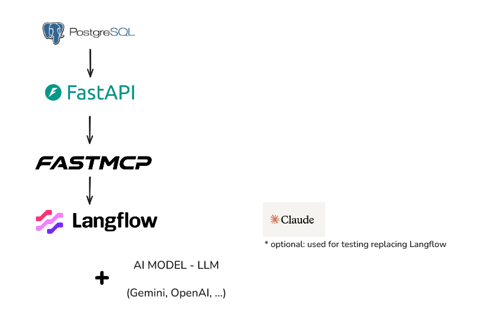

# Procurement Tracking API + MCP Server

This repository contains a small procurement tracking platform built around three main pieces:

- a PostgreSQL database seeded with sample procurement data
- a FastAPI backend for packages, PSR tracking, timelines, and analytics
- a FastMCP server that exposes selected backend capabilities as MCP tools

Langflow is also included in Docker Compose as an optional visual layer for experimenting with flows that consume the API and MCP services.

Another option for testing is Claude Desktop configured to connect to the MCP server.

Example `claude_desktop_config.json`:

```
{
  "preferences": {
    "coworkWebSearchEnabled": true,
    "coworkScheduledTasksEnabled": false,
    "ccdScheduledTasksEnabled": false,
    "sidebarMode": "chat"
  },
  "mcpServers": {
    "backend-tools": {
      "command": "npx",
      "args": ["mcp-remote", "http://localhost:8002/mcp/"]
    }
  }
}
```

The stack is designed for local development with Docker Compose.



## What It Does

The backend tracks procurement packages across ordered milestones and compares planned dates against actual completion dates. On top of the CRUD-style API, it provides timeline and delay analytics that can also be accessed through the MCP server.

Main capabilities:

- manage procurement packages
- create and update PSR milestone records
- view package timelines
- analyze delayed milestones and delayed packages
- summarize delays by category, milestone, or package
- expose analytics through MCP for agent-based workflows

## Services

The root compose file starts these services:

- `postgres`: PostgreSQL with the `pgvector` image and seeded sample data
- `api`: FastAPI backend, exposed on `http://localhost:8001`
- `mcpserver`: FastMCP server, exposed on `http://localhost:8002/mcp/`
- `langflow`: optional Langflow UI, exposed on `http://localhost:7860`
- `Claude Desktop`: optional local client for testing the MCP server

## Quick Start

Run the full stack:

```bash
docker compose up --build
```

Stop it:

```bash
docker compose down
```

## Useful URLs

- Backend health: `http://localhost:8001/`
- Backend docs: `http://localhost:8001/docs`
- MCP endpoint: `http://localhost:8002/mcp/`
- Langflow: `http://localhost:7860`

## Backend API Areas

The FastAPI app exposes these route groups:

- `/packages`: list, create, update, and deactivate packages
- `/psr`: create and update planned vs actual milestone records
- `/timeline/{package_id}`: package timeline view ordered by milestone
- `/analytics`: delay-focused reporting endpoints

The data model is centered on:

- `packages`
- `milestones`
- `psr`
- `comments`

The database initializer in `database/scripts/init.sql` creates the schema and seeds sample milestone and package data so analytics can be tested immediately.

## MCP Tools

The MCP server proxies backend endpoints as tools. The current server includes tools for:

- backend health/status
- package listing
- delayed milestones
- delayed package summaries
- delay summaries by category
- delay summaries by milestone
- delay summaries by package
- package status by `package_id`

This makes the analytics layer available to MCP-compatible clients without exposing the database directly.

## Project Structure

```text
backend/     FastAPI application and business logic
database/    database files and SQL seed script
mcpserver/   FastMCP server that wraps backend endpoints
```

## Notes

- The backend container currently runs Uvicorn with `--reload`, which is convenient for development.
- The backend uses `DATABASE_URL` from environment variables and defaults to the Compose PostgreSQL service.
- The MCP server uses the backend service URL inside Docker networking, so both services are expected to run on the same Compose network.
- Langflow is started as a Docker Compose service and can be used as a visual testing client.
- The LLM API key should be configured in the Langflow UI when needed.